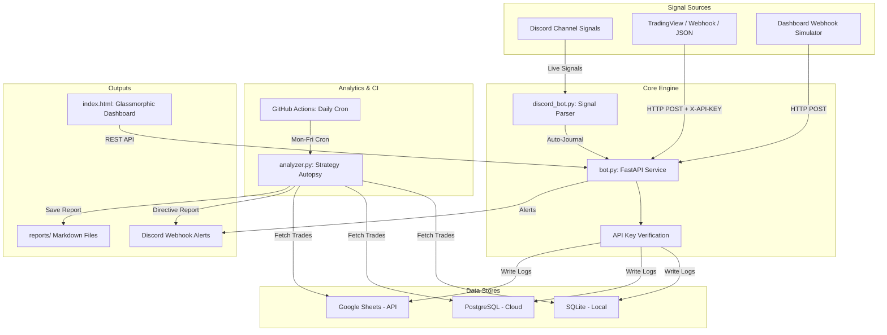

# ⚡ Au Quant Bot — GOLD Trading Journal & Strategy Optimizer

A production-grade, automated trading journal system purpose-built for **GOLD (XAUUSD)** trading. It listens for live trading signals from your Discord channel, auto-journals every trade, performs statistical analysis, and delivers actionable directives — all from a sleek glassmorphic dashboard.

---

## 🛠️ System Architecture



---

## 📦 Features

| Feature | Description |
|---|---|
| **Discord Signal Listener** | Auto-parses BUY/SELL opens, break-evens, partials, and close signals from your Discord channel |
| **Multi-Backend Storage** | SQLite (local), PostgreSQL (cloud), or Google Sheets — switch with one env variable |
| **FastAPI Webhook API** | Secure, async endpoints with `X-API-KEY` header auth |
| **Manual Trade Editing** | Edit any trade field directly from the dashboard UI via modal form |
| **R-Multiple Tracking** | Auto-calculates risk-to-reward multiples on every close |
| **Pips & Risk-Free Tracking** | Accumulates partial TP pips, tracks break-even / risk-free status |
| **Strategy Autopsy** | Win rate, profit factor, expectancy, asset-specific performance analysis |
| **Failure Correlation** | Identifies which psychological factors (FOMO, news, revenge) cause losses |
| **Actionable Directives** | Clear alerts: **Double Down**, **What to Change**, **What to Stop** |
| **Glassmorphic Dashboard** | Interactive charts, trade journal logs, webhook simulator — all in one HTML file |
| **Discord Alerts** | Rich-embed execution alerts and daily directive reports to your Discord |
| **GitHub Actions CI** | Automated daily analysis pipeline with Discord notifications |

---

## 🚀 Quick Start

### 1. Clone & Install
```bash
git clone https://github.com/YOUR-USERNAME/au-quant-bot.git
cd au-quant-bot
python -m venv .venv
.venv\Scripts\activate       # Windows
# source .venv/bin/activate  # macOS/Linux
pip install -r requirements.txt
```

### 2. Configure Environment
```bash
cp .env.example .env
```

Edit `.env` with your values:

| Variable | Required | Description |
|---|---|---|
| `DATABASE_TYPE` | ✅ | `sqlite`, `postgres`, or `sheets` |
| `API_KEY` | ✅ | Secret key for webhook authentication |
| `DISCORD_BOT_TOKEN` | For Discord bot | Your Discord bot token |
| `DISCORD_CHANNEL_ID` | For Discord bot | Channel ID where you post signals |
| `DISCORD_WEBHOOK_URL` | Optional | Discord webhook for notifications |
| `SQLITE_DB_PATH` | SQLite only | Default: `trades.db` |
| `DATABASE_URL` | Postgres only | PostgreSQL connection string |
| `GOOGLE_SPREADSHEET_ID` | Sheets only | Google Spreadsheet ID |
| `GOOGLE_SERVICE_ACCOUNT_CREDENTIALS` | Sheets only | Service account JSON |

### 3. Start the API Server
```bash
python bot.py
```
The server starts on `http://localhost:8000`

### 4. Start the Discord Bot
```bash
python discord_bot.py
```
The bot connects to your Discord channel and starts listening for GOLD signals.

### 5. Open the Dashboard
Open `index.html` in your browser. It auto-connects to the local API server.

---

## 🤖 Discord Bot Setup

### Creating the Bot

1. Go to the [Discord Developer Portal](https://discord.com/developers/applications)
2. Click **New Application** → Name it **Au Quant Bot**
3. Go to **Bot** tab → Click **Reset Token** → Copy the token
4. Enable **Message Content Intent** under Privileged Gateway Intents
5. Go to **OAuth2** → **URL Generator**:
   - Scopes: `bot`
   - Permissions: `Read Messages/View Channels`, `Read Message History`
6. Copy the generated URL and open it to invite the bot to your server

### Getting the Channel ID

1. Open Discord → **Settings** → **Advanced** → Enable **Developer Mode**
2. Right-click your signals channel → **Copy Channel ID**

### Signal Formats the Bot Understands

```
📈 GOLD BUY 2350.50 SL 2340.50 TP 2375.00
Session: London, Timeframe: 15M -> 1M
Confirmations: Liquidity Sweep, MSS, FVG Alignment
```

```
🔒 GOLD BE — Move SL to entry (Risk Free)
```

```
💰 GOLD Partial TP hit +45 pips
```

```
✅ GOLD CLOSED at 2375.00 | +3.5R | +245 pips | FULL BOOK
```

---

## 🔌 API Endpoints

All endpoints require `X-API-KEY` header.

| Method | Endpoint | Description |
|---|---|---|
| `POST` | `/trades/open` | Open a new trade position |
| `POST` | `/trades/close` | Close an existing trade |
| `POST` | `/trades/log` | Log a completed trade directly |
| `PUT` | `/trades/{trade_id}` | Edit any field on an existing trade |
| `GET` | `/trades` | Fetch all trade logs |
| `GET` | `/directive` | Get latest strategy analysis directive |

### Example: Open Trade
```json
POST /trades/open
{
  "pair": "XAUUSD",
  "direction": "BUY",
  "entry_price": 2350.50,
  "sl": 2340.50,
  "tp": 2375.00,
  "technique": "Order Block Refinement",
  "session": "London",
  "timeframe": "15M -> 1M",
  "confirmations": "Liquidity Sweep, MSS, FVG Alignment"
}
```

### Example: Edit Trade
```json
PUT /trades/{trade_id}
{
  "sl": 2345.00,
  "is_risk_free": 1,
  "confirmations": "Updated confirmations"
}
```

---

## 🧪 Testing

### Seed Mock Trades
```bash
python test_webhook.py --mode direct --count 15    # Direct DB insert
python test_webhook.py --mode webhook --count 10   # Via API endpoints
```

### Run Discord Parser Tests
```bash
python -m unittest test_discord_parser.py
```

### Run End-to-End API Tests
```bash
python test_e2e_api.py
```

### Run Strategy Analysis
```bash
python analyzer.py
```

---

## ⚙️ GitHub Actions

Automated daily analysis is configured in `.github/workflows/daily_analysis.yml`.

1. Push code to GitHub
2. Go to **Settings → Secrets → Actions** and add:
   - `DATABASE_TYPE`, `DATABASE_URL`, `DISCORD_WEBHOOK_URL`
   - Google Sheets credentials if using sheets backend
3. The workflow runs Mon-Fri at 22:00 UTC, generates directives, and sends them to Discord

---

## 📁 Project Structure

```
au-quant-bot/
├── bot.py                  # FastAPI webhook server + REST API
├── discord_bot.py          # Discord signal listener & parser
├── analyzer.py             # Strategy autopsy & directive engine
├── config.py               # Environment configuration
├── index.html              # Glassmorphic dashboard UI
├── requirements.txt        # Python dependencies
├── .env.example            # Environment template
├── db/
│   ├── __init__.py         # Database factory
│   ├── base.py             # Abstract data store interface
│   ├── sqlite.py           # SQLite adapter
│   ├── postgres.py         # PostgreSQL adapter (SQLAlchemy)
│   └── sheets.py           # Google Sheets adapter (gspread)
├── reports/                # Generated analysis reports
├── .github/
│   └── workflows/
│       └── daily_analysis.yml  # Automated daily cron job
└── tests/
    ├── test_discord_parser.py  # Discord parser unit tests
    ├── test_e2e_api.py         # End-to-end API integration tests
    └── test_webhook.py         # Webhook simulation & DB seeding
```

---

## 📜 License

MIT License — use it, modify it, profit from it. Trade responsibly.

---

> **Au Quant Bot** — *Your GOLD trades, auto-journaled, auto-analyzed, auto-optimized.*
